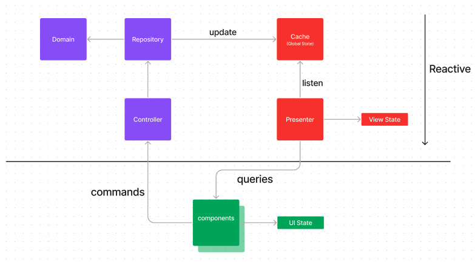

## Traffic Light Application

#### Introduction

This project was developed based on a task of the [course Essencialist](https://www.essentialist.dev), created by [Khalil Stemmler](https://github.com/stemmlerjs).

#### Description

The original task was to create a traffic light state machine and making use of a coordinator to manage the transitions between the states.

This extended version of the task consists of a complete frontend application that simulated a set of traffic lights, where the user can turn on and off the lights, but the transitions between the states are managed by the coordinator.

The main point of this project is to implement a decoupled architecture, where the frontend library or framework is merely a detail, and the business logic is completely decoupled from it.

Notice that the domain was implemented using TDD to guide the emergent design.

#### Getting Started

To run the application, follow the steps below from the root of the project:

```bash
# install dependencies
$ yarn

# run the application
$ yarn dev
```

To run the tests, follow the steps below from the root of the project:

```bash
# run the tests
$ yarn test
```

To watch the tests, follow the steps below from the root of the project:

```bash
# run the tests
$ yarn test:dev
```

#### Technologies

- Typescript
- ReactJS
- Vite
- mobx (reactivity)

#### Core Architecture

The lifecycle of the traffic light respects the following flow:


The Coordinator is responsible for managing the transitions between the states. As the transitions happen over time, the Coordinator is an abstraction of a Clock. This abstraction is decoupled fro infrastructure details, such as the setInterval function.


This two abstraction are the core of the application.

The Sequence Diagram bellow shows the flow of the application:


Each traffic light has its own state machine, and the coordinator is responsible for managing the transitions of them independently.


### Frontend Architecture

The core described above is part of the frontend architecture. The purpose of this architecture is to decouple the business logic from the frontend library or framework.

The diagram below shows the frontend architecture:



In case of a change in the frontend library or framework, the only thing that needs to be changed is the implementation of the View and adjust the presented. The business logic is completely decoupled from the View.

Notice that CQRS is used to separate the read and write operations. The read operations are reactive, in a way the the presented is responsible for subscribing to the changes in the state of the application and propagate them its children. The write operations are requests that are sent to the controller.

The repository is a facade to the domain data. It is responsible for providing the necessary data requested by the controller.

#### Demonstration


